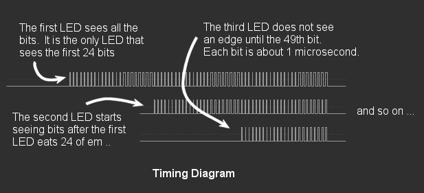
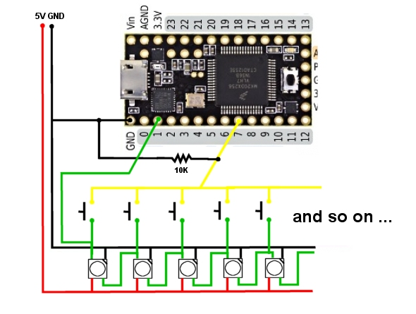
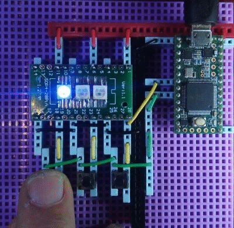
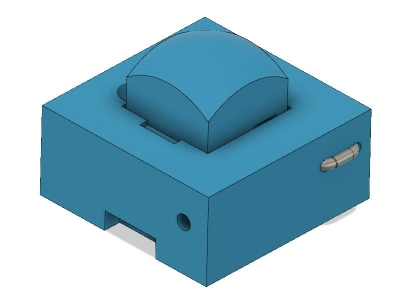
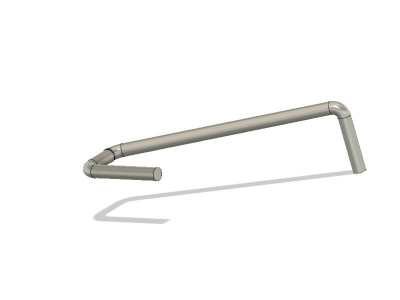

# One Wire 3D Printed ws2812b Switch Array

This repository contains the STL and Fusion 360 files used to
create a **3D printed switch** which can be attached to a ws2812 LED
in an array or strip in order to create an array of buttons that
can be sensed by a microprocessor using only **one GPIO pin**.

There are **no multiplexers** involved, and there is **no X-Y grid**
of wires connected to the switches!

It also contains a specific test implementation and demonstration
program (sketch) using a Teensy 3.2 and a commonly available
8x32 LED array.  Below is link to a YouTube video showing the
demonstration program in action, and discussing briefly how the
project works:

**THIS IS ONLY A PROOF OF CONCEPT DEMONSTRATION**

There are a couple of major caveats:

* The technology shown here *may* suffice for DIY purposes, but
  is probably not mature enough, yet, for use in commercial products.
  
* This project is not for the faint-of-heart.  The switches can be
  difficult to print and assemble, requiring the use of a 0.25 or
  smaller nozzle, lowered print speeds, and good filaments. Getting
  the size, and bends, in the guitar string spring/contacts takes
  a lot of patience and at least a few tries.
  
In this repository you can find the STL and Fusion 360 files for
the 3D printed swtiches, along with the source code for the
demostration program.   Please see the readme files in
the subdirectories for more information:

   [/stl - PRINTING THE SWITCHES](stl/readme.md)

   [/src - THE DEMO PROGRAM](src/readme.md)

This **github repository** is the authorative source of information about this project.
There is also a Hackaday project at [One Wire 3D Printed ws2812 Switch Array](https://hackaday.io/project/167696-one-wire-3d-printed-ws2812b-switch-array)
and a Thingiverse page at [ws2812b Switch](https://www.thingiverse.com/thing:3870539) that contains mostly
the same information, in slightly different presentations.

## HOW THEY WORK

The concept takes advantage of the fact that such LEDs arrays are
fed with a single serial data stream that is successivly passed
down from the first LED in the array to each LED in turn.

Each LED "eats" 24 bits of color information before it begins passing
the subsequent bits onto the next LED.  We also take advantage of the
fact that in the ws2812b protocol every bit, whether a "zero" or a "one"
bit, consists of at least one "rising edge" delivered to each LED.

Thus, by attaching a switch to the DIN (data in) pin of each LED, and
connecting all of those switches to a single common wire back to the
CPU, based on the timing, we can determine which switch, if any, is
pressed during a refresh cycle.

The technique can only detect the FIRST button pressed in such an array.
It cannot detect multiple simultaneous button presses. There are other
limitations and issues that will be discussed below.

This example works with an interrupt on the Teensy to measure the
amount of time it takes, from the beginning of a refresh cycle until
the interrupt is triggered to determine which button is pressed.
On the Teensy 3.2 at 90Mhz using the FastLed library, it takes just
about 30 microseconds per LED.  So, basically, we just divide the
number of microseconds to the interrupt by 30 and we get the "button number"
of the (first/earliest) button that is pressed.

This works well in the limited test program, which makes use of the
FastLed, non-blocking, ws2812b library, which in turn uses DMA and
a hardware UART to send the bits to the LEDs. Because it is non-blocking,
and it leaves interrupts enabled, we can use such an approach.

## THIS IDEA SHOULD WORK WITH ANY CPU and/or LIBRARY

Although this demostration uses the FastLed library and Teensy 3.2,
this concept should be usable with ANY cpu that is currently used to
control such a ws2812b, or other similar, addressable LED array, including
Arduinos and Raspberry Pi's.

**It should also work with different sized arrays, LED strips, circles, etc**

An earlier demostration of this idea, that used a synchronous detection
approach is available on my previous hackaday page [Why Doesn't Someone Make a ws2812 Switch Array?](https://hackaday.io/page/6514-why-doesnt-someone-make-a-ws2812b-switch-array)

In that example, and for other ws2812b libraries, like the Adafruit
NeoPixel library, that send the bits to the LEDS synchronously (one by
one via the CPU), an alternative approach can be used if interrupts are
disabled, or if so desired for some other reason.

In that case the low level procedure that sends the bits to the LEDs just
has to have access to a counter that tells it, at any time, which LED
it is sending bits to (each LED takes 24 bits). It can then check the
input line just after it sends out the rising edge of any, or all,
of the bits to each LED, and return the counter as the "number" of
the button that is pressed.

## 3D Printed Switch Issues

Requirements:

* for FDM printers, I think a 0.25 or smaller nozzle may be needed
* a 0.010 high "E" guitar string
* some hemostats or small needle nosed pliers to bend the guitar string

### NOZZLE

When I started 3D printing a month or two ago, I immediately went to ebay
and bought a number of inexpensive replacement 0.40 brass nozzles, figuring
I would need them.  At that time I also picked up a variety of different sized
(cheap) stainless steel nozzles for the printer. I think I paid $20 or so for 10
stainless nozzles from 1.0 down to 0.20 mm in size.  I am **not** an expert
at 3D printing and this was my first attempt with a 0.20 nozzle.

You *may* be able to print these with a 0.40 nozzle.  I dunno. I never tried.
I actually started this project by changing the nozzle on the printer and
trying to print really small things for the first time.

### PRINTING TINY THINGS

There are only two printed parts.  The **base** and the **top**.

I will be honest and tell you it was not easy. I found the entire process to
be very finicky.  What would work with one filament would then fail miserably
when I tried it with a different filament.  Or I could get it to print one
switch "base" or "top", but then when I tried (in SlicePE) to print 8 or 16
of the same things, it would fail.  I had to mess around and experiment with
brims and supports, and trying to print the parts every which way.

The current Fusion 360 and STL files are tuned so that they work with my
printer and settings to correctly hold the 0.010 guitar string and 22 guage
wire, so that the switches properly "snap" onto the ws2812 LEDs, and so that
they fit together in an array.

Your mileage may vary!

### THE GUITAR STRING

The other thing is the "spring" and "contact" made out of a single small
piece of a 0.010 guitar string.   I don't have access to any hardware stores
and so I was forced to make do with what I have here on the boat.  As a guitar
player I have bunch of new and old used guitar strings laying around.  I played
around with the different strings E .... B ..... the wire wound G string ... and
found that the **high E string** had just about the right amount of springyness to
work in such a button.

**Cutting and Bending the Guitar String just right is the most difficult part**

I went through over 20 iterations of the design trying to come up with a way
to (a) make a springy switch and (b) make contact with the DIN pin on each LED,
and (c) connect all the switches together, before narrowing in on this approach.

This approach uses a single small piece of guitar string to meet all three requirements.
The piece of guitar string is both the "spring" for the switch, as
well as the "contact" for the DIN pin, as well as the "connector" to a piece of
22 guiage wire.

Thus it is the most critical piece in the assembly of the switches.

This little piece of wire has to do a lot of work, and must be cut and
bent just right in order to function.

* it has to have a little angle in it so that it acts as a spring to push the button up.
* the other end must be bent and cut just right so that when it is pushed down it makes
  contact with the LED DIN pin
* the holes on the printed switch must be aligned so that the 22 guage wire
  just barely makes conact with the guitar spring when the switch is in an
  "open" position.
  
As I was experimenting, by the time I got it down to one piece of guitar string,
by coincidence, I found that, if the holes were positioned JUST RIGHT, that I
could slide a normal 22 guage solid copper breadboard wire into the holes and they
would make contact with the guitar string in each switch.

In fact, when you press the switch, it pushes down the guitar string down,
re-enforcing the contact with the 22 guage wire first as it then bends down
further to make contact with the DIN pin on the LED.  In this latest (posted)
version of the switch, the 22 guage wire should fit easily into the switches
and when you press the button it should sort of "lock" the 22 guage wire in.

If you find you have to force the 22 guage wire into the hole then you'll
either need to change your print settings, or even go so far as to modify the
design in the Fusion 360 files yourself.

Once again, this is just a "proof of concept". I have some ideas, below,
for future development of more robust and usable switches, possibly involving
printed circuit boards and/or other manufacturing processes..

### ISSUES AND FUTURE IDEAS

* At a minimum each switch needs a diode between the DIN pin on the LED and the
common wire back to the CPU.  Otherwise (with the current circuit) if two buttons
are pressed simultaneously, it connects the two DIN pins, and messes up the serial
data stream.  The switch detection algorithm still works, but the LED array itself
may flash or display the wrong colors as a result of this short circuit.

* I would like to figure out how to "gate" the interrupt signal at each switch
using some kind of a small simple SMD device so that once an interrupt fires,
THAT pin is then disabled from sending any more interrupts.   That would allow
for the detection of multiple simultaneous keypresses.

* I want to explore the use of the ws2812b **2020** LED and custom printed PCB's,
possibly flexible.  The 2020 LED is only 2x2 mm and that would allow a higher
density of switches in the array.  Instead of a 3D printed 10mm switch, I would
then consider tooling up for a (an array of) 4x4 mm soft silicon switch(es).

By the way, this is all (still) nominally part of the
[rPi bare metal Guitar Rig](https://hackaday.io/project/165696-rpi-bare-metal-vguitar-rig) project.
My idea here is to create a **foot-touch-pad** ... like putting a touchscreen on the floor and
using it with your feet.  There are no such (inexpensive) commercially available foot pads,
and there is no way I'm gonna put a $700 iPad on the ground, face up, at a gig, in a bar-room
situation.   I'd like to be able to also get some feedback (i.e. the LED display) about
things like volume levels, patch selections, song position, etc, so I am thinking that a
general purpose controller of this sort could be handy.   It might also be useful for
other purposes, including for use by disabled persons, so it is a project I will continue
to explore.

