# 3D Printed Switches for ws2812b LEDs

This directory contains the STL files for the switches used in the
[One Wire 3D Printed ws2812 Switch Array](../readme.md) project, along
with the **printing** and **assembly** instructions.  You can find
the Fusion 360 files [HERE](https://github.com/phorton1/projects-ws2812bSwitchArray1/tree/master/fusion).

Since they are so small, printing them boils down to an exersize in
trying to print really small things on your printer.

The switch uses a piece of wire (I used a 0.010 high "E" guitar string)
as the spring, contact, and connector.

**The hardest part of the whole project** is to **cut** and **bend** those
pieces of wire **correctly and repeatably**.

It took quite a few tries, but I found that after a while I could do it
reliably and repeatedly

## QUALITY CONTROL

I suggest building one or two, then building 4 or 5, before gearing up for
a production run if you want to try to print and build a lot of these.

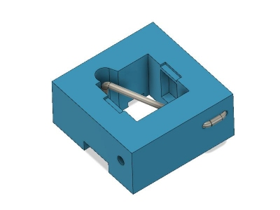

Also I recommend assembling and testing them one at a time before stringing
them together into a big array. As I assembled and tested them, I used
three "bins" for the testing results:

* the **"A" bin** contained switches that worked the first time I tried them,
 were nice and springy, and which worked at least a few times reliably,
 in a row, without any gliches.
* the **"B" bin** contained switches that were almost right, but which had **one**
 issue that could probably be solved by popping off the top and tweaking the
 guitar string, but which probably did not need the entire guitar string to
 be replaced, and ...
* the **"C" bin** which contained switches that I should have known would not
 work in the first place.  These are usually ones where the guitar string
 was not bent correctly to begin with, got bent out of shape during
 the assembly process itself, or on which I *missed* the final critical
 bend and trim.   These I had to take the wire out and rebuild from
 scratch.
 
It was fairly rare that once a switch base and top were printed correctly
that they were damaged or made unusable by re-assembly, so I could generally
re-use the 3d printed parts, but it is still a pain to disassemble them, and so,
in the end, it's better to not try to force the issue.

If something doesn't go right during the wire bending and cutting process,
just stop, teke a break, and re-do that one!

The wire is not expensive and you can do the initial bend and cut in less
than 30 seconds ... so you *could* make a hundred or more of them in an
hour.  Better to just start over if it doesn't feel right as you are working!

In any case, only after you are sure that the buttons are working good
should you try to string them together into an array!  If you get a
bad button in the middle of a long string, in the middle of the array,
it can be a real pain to get to that button and fix it!
 

## PRINTING THE SWITCHES

I generally used a pretty hot **bed at 70C** with the **nozzle at 215C** .. 

I have a **Prusa MK3s** and used an inexpensive chinese
**stainless steel 0.2mm nozzle** with some garden variety
**Mika3D** white **PLA** filament.

I didn't try printing them with the normal 0.4mm nozzle.  It might work
and is certainly worth a try if you don't have a smaller nozzle or
don't want to change yours. I suspect that the smallest nozzle you are
comfortable with should be used.

I printed the **base** upside down (with the bottom up, and the top
on the print surface) at **0.10mm layer height**.  At 10x10 mm it was
just big enough to not require a brim on my printer.

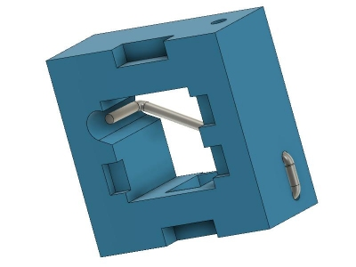

I printed the **top** right side up at **0x05mm layer height**.  As these
are less than 5x5mm, I needed to add a **pretty wide brim** .. 2mm I think ...
around each one so that they would adhere to the print surface.

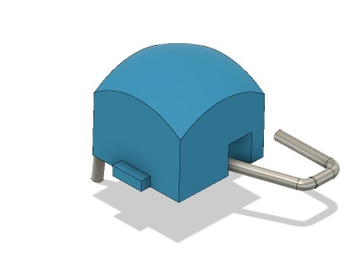

I started with the standard Prusa settings for the MK3S with a 0.25 nozzle
and then messed around with those until it worked.   One thing for sure,
you will want to **lower the print speed** signficantly, however you do it.
I went through and modified the default profiles manually usually halfing
any numbers I saw ... printing around 20mm/sec ... lessened accelerations,
etc ... who know!  I'm also using Octoprint and so I diddled with the 
overall "Feed Rate" there as well.

Seems like I **recalibrated the first layer** for each print session.

I also played around with extrusion rates multipliers, elaphant foot
compensation and a host of other things ... sometimes helpful ... sometimes
not ...

I got totally different results and had to re-tune everything when I
changed to some other garden variety black PLA filament.  And when
I tried printing them with some bad-old-transparent PLA that
I have (I live on a **BOAT** in the **TROPICS** lol), it just
resulted in a small bubbly stringy mess and a clogged nozzle
repair session ... so **good filament is a must!**

In one generation I had to sand the sides of the top's to even get them
in the holes.   Then I found I had a jewler's file and used that ...
the next generation they slid in an out with any modification!!

You're probably more of an expert at 3D printing than I am!  I only
started two months ago!

The bottom line is that these are small and cheap, yet difficult and
time consuming to print, and that dialing them in on your printer will
take some effort and that I can't easily tell you how to do it right the
first time. In the end all that is important is (a) that they snap on to
the ws28128 LEDS and don't fall off, (b) the holes and features are about
the right size and in the right place, and (c) that the top moves inside
the base correctly.

I'd like to hear from someone who tries to print these on an SLA
printer.  That would probably work pretty good ... 

## ASSEMBLING THE SWITCHES

There are a number of steps I can detail in the bending of the wire
and assembly of the switch

1. **the initial bend** - itself is in two parts.

   [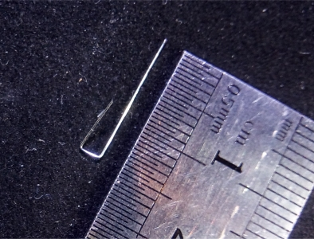](../images/assembly01-wire_dimensions.jpg)
   [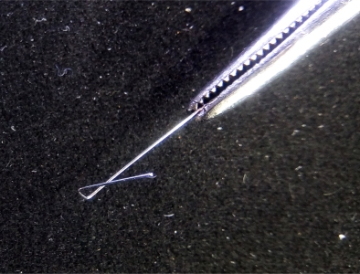](../images/assembly02-wire_bend.jpg) |

   (note that the pictures above do not show what I'm saying below!!)
   
   First I go about 15mm down from the end of the wire, snap the
   hemostats on the wire with as small a cross section as possible,
   and turn the hemostats top towards me while pulling the wire
   underneath and a bit to the right.  That makes a right angle
   bend with a circular remainder.
   
   Then I take just the tip of the hemostats, hook them into the
   circular part and bend that a little more so that it's got right
   angles with the proper tilt and spacing.
   
2. **cut the piece off of the main wire**  - I then liberate the
  piece from the main wire by cutting it **about 4 mm** from the
  bend.
  
   (NOW the pictures start following the instructions a little
  more closely!!)
  
3. **insert the wire into the switch** - insert the long end of the
  wire into the hole and feed it through so that it comes out the
  top of the switch. It will be under a little bit of tension and
  that's ok, but you should not need to actually BEND the wire
  while inserting it.

   [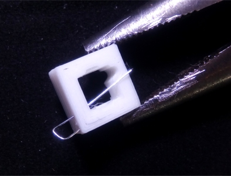](../images/assembly03-insert_wire.jpg)
  
   Then with the hemostats or a small pair of needle nose pliers
   slightly twist and push the small end of the wire into the
   other hole at the same time you feed the remainder of the long
   part thru.
  
   If all goes well you will be left with a 1mm or so imperfect
   loop outside of the switch.
  
4. **compress the wire into the switch** - I then used small needle
  nose pliers around each side of the switch to do a final **press**
  of the wire into the switch.  If all goes well there should not
  be any play in the main wire .. and no big ugly bent piece of wire
  on the outside of the switch!  It should be nicely seated in the
  switch with a nice little piece of the wire visible on the outside
  of the switch.

   [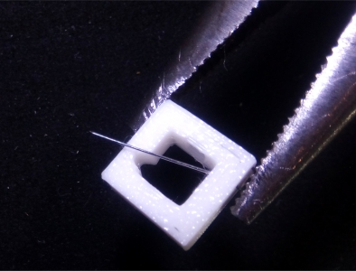](../images/assembly04-press_wire_in.jpg)
  
5. **trim the wire to about "here"**.  Next I line up the wire diagonally
  with the "down hole" on the switch base while trimming (cutting) it
  flush with the outer edge of the switch (or so).  So at that point the
  wire should exceed the dimension to the hole by about 1 or 1.5mm.

   [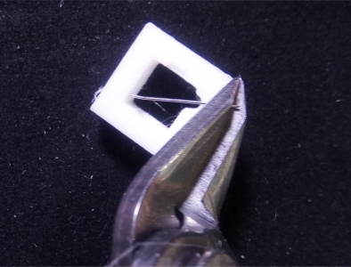](../images/assembly05-cut_wire_flush.jpg)
  
   Note that in the photo I show some flush cut shears.  **DONT USE
   YOUR FLUSH CUT SHEARS** with the steel guitar string.  It will ruin
   them!  At least if they are like mine (i.e. cheap chinese ones),
   they will not cut steel. Well, they'll cut it, but it will also
   leave a dig in the blade and basically ruin the cutters!
  
   In actuality I used some big-honking (regular sized) wire
   cutters that can handle the steel guitar strings without any
   damage any time I have to cut it!
  
6. **THE CRITICAL DOWN-BEND**.  Now, taking **just the tip** of the
  hemostats, grab the end of the wire and bend it so that it points
  downwards towards or into the "down-hole".   This bend should be
  "just about" 90 degrees, but should definitely not be more!
  
   [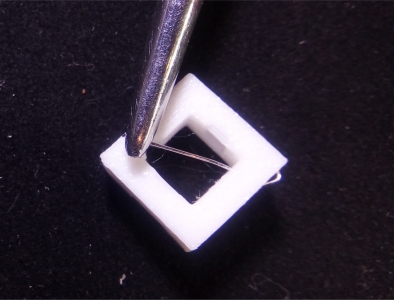](../images/assembly06-bend_wire_with_hemostats.jpg)
  
   If this critical step goes well, the end of wire will just barely
   not fall down into the hole right after the bend, and you will still
   need to sort of force it in there with an exacto knife or the hemostats.
   Yet, once it is inside the hole, that the wire should be somewhat
   centered in the hole, so that when the button is pressed the wire
   goes down through the hole to make contact with the DIN pin
   of the LED.

   [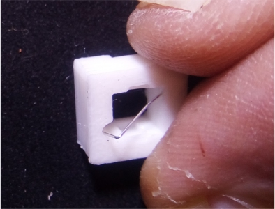](../images/assembly07-check_and_trim_wire.jpg)
  
   I did say it would take some practice, didn't I?
  
7. **Final Trim** - at that point I usually turn the button upside down,
  press the housing down so that the wire comes up thru the bottom of the
  swtich, and trim the wire so that it is flush with the switch when the
  button is depressed.   Too much and it won't make contact.  Yet you
  want a little play in it.  It **should not** extend to the bottom of
  the switch when the switch is not depressed!

8. **Insert the Top** - You can then insert the top part into the
  switch.  I found this works best by inserting it at an angle,
  with the side nearest the input wire going in first, and then
  turning it as I press the other side into the switch.
  
   [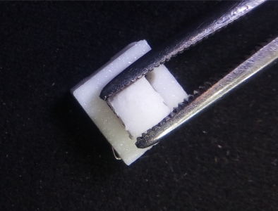](../images/assembly08-assembly08-insert_top.jpg)
  

9. **Insert the 22 guage Wire** and **test it** - at this point
  I insert a piece of 22 guage wire into the switch.  It should
  go in easily, yet with some resistance, while the switch is open.
  Ideally, when the switch is closed you will notice that it is
  firmly stuck in the switch.

   [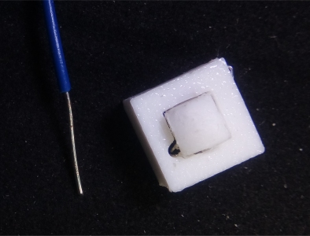](../images/assembly09-srtip_22_guage_wire.jpg)
  
   [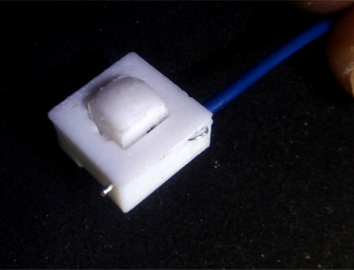](../images/assembly10-insert_22_guage_wire_finished.jpg)
  
------------------------------------------

### Pop the button on the array and try it!
  
* If it works good, put it in Bin A :-)
* If not, try, try again :-()

   
